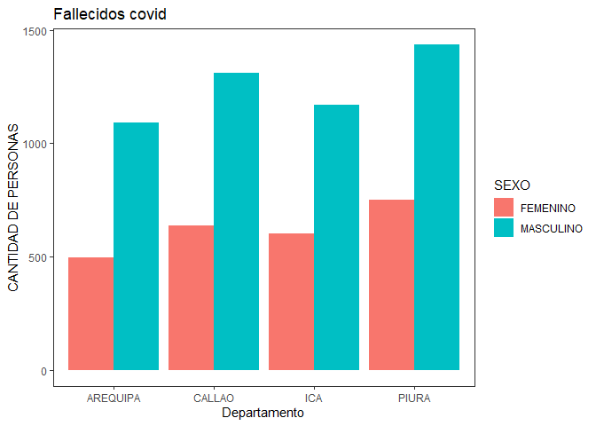

Mitarea
================
Ferjame
10/12/2021

***Alumno*** **:** *Fern*

### Fer

**Nivel 2**

**2.** *Analizar la data de los fallecidos por covid en regiones
escogidas a su criterio.*

``` r
fallecidos_covid <- read.csv("G:/Mi unidad/UNMSM/Ciclo IV/Programacion/Semana 7/fallecidos_covid.csv", sep=";", na.strings="NA", stringsAsFactors=TRUE)
summary(fallecidos_covid)
```

    ##   FECHA_CORTE                                     UUID      
    ##  Min.   :20201118   000061cf65f7f0370461e74d909ca233:    1  
    ##  1st Qu.:20201118   00054bc1e7f0c69eb17171be1df08e4c:    1  
    ##  Median :20201118   0006c36e44661d52db85766491306d39:    1  
    ##  Mean   :20201118   000709ae96eecec2ab5f6cc98330d554:    1  
    ##  3rd Qu.:20201118   000764e60b0600125c11cbf449b60843:    1  
    ##  Max.   :20201118   000b8c86054f5a85000f21d45919de58:    1  
    ##                     (Other)                         :37028  
    ##  FECHA_FALLECIMIENTO EDAD_DECLARADA          SEXO         FECHA_NAC       
    ##  Min.   :20200318    Min.   :  0.00   10       :    3   Min.   :19120319  
    ##  1st Qu.:20200529    1st Qu.: 57.00   11       :    7   1st Qu.:19431228  
    ##  Median :20200703    Median : 67.00   FEMENINO :11633   Median :19530422  
    ##  Mean   :20200712    Mean   : 65.97   MASCULINO:25391   Mean   :19536481  
    ##  3rd Qu.:20200823    3rd Qu.: 76.00                     3rd Qu.:19621006  
    ##  Max.   :20201218    Max.   :108.00                     Max.   :20200820  
    ##                                                         NA's   :5286      
    ##       DEPARTAMENTO      PROVINCIA                       DISTRITO    
    ##  LIMA       :16553   LIMA    :14911   SAN JUAN DE LURIGANCHO: 1661  
    ##  LA LIBERTAD: 2433   CALLAO  : 1786   LIMA                  : 1209  
    ##  PIURA      : 2184   TRUJILLO: 1680   CALLAO                : 1127  
    ##  CALLAO     : 1947   AREQUIPA: 1392   SAN MARTIN DE PORRES  : 1057  
    ##  LAMBAYEQUE : 1898   CHICLAYO: 1289   COMAS                 :  964  
    ##  ICA        : 1769   PIURA   :  919   VILLA EL SALVADOR     :  940  
    ##  (Other)    :10250   (Other) :15057   (Other)               :30076

``` r
str(fallecidos_covid)
```

    ## 'data.frame':    37034 obs. of  9 variables:
    ##  $ FECHA_CORTE        : int  20201118 20201118 20201118 20201118 20201118 20201118 20201118 20201118 20201118 20201118 ...
    ##  $ UUID               : Factor w/ 37034 levels "000061cf65f7f0370461e74d909ca233",..: 36353 21961 28532 36032 18083 27512 7054 30947 4712 23956 ...
    ##  $ FECHA_FALLECIMIENTO: int  20200709 20200709 20200709 20200709 20200709 20200709 20200709 20200709 20200709 20200709 ...
    ##  $ EDAD_DECLARADA     : int  88 68 70 67 54 48 54 81 64 60 ...
    ##  $ SEXO               : Factor w/ 4 levels "10","11","FEMENINO",..: 4 4 4 3 4 4 4 4 3 4 ...
    ##  $ FECHA_NAC          : int  19310928 19520226 19500303 19530106 19650823 19720606 19651027 19381129 19550802 19600417 ...
    ##  $ DEPARTAMENTO       : Factor w/ 25 levels "AMAZONAS","ANCASH",..: 4 12 8 7 12 15 4 4 4 11 ...
    ##  $ PROVINCIA          : Factor w/ 201 levels "","ABANCAY","ACOBAMBA",..: 12 91 110 29 106 94 30 12 12 102 ...
    ##  $ DISTRITO           : Factor w/ 1193 levels "","ABANCAY","ACARI",..: 773 221 325 1132 714 195 626 62 773 446 ...

**2.1.** *R ealizar un grafico y analizar.*

``` r
library(tidyverse)
```

    ## Warning: package 'tidyverse' was built under R version 4.1.2

    ## -- Attaching packages --------------------------------------- tidyverse 1.3.1 --

    ## v ggplot2 3.3.5     v purrr   0.3.4
    ## v tibble  3.1.5     v dplyr   1.0.7
    ## v tidyr   1.1.4     v stringr 1.4.0
    ## v readr   2.1.0     v forcats 0.5.1

    ## Warning: package 'ggplot2' was built under R version 4.1.2

    ## Warning: package 'tidyr' was built under R version 4.1.2

    ## Warning: package 'readr' was built under R version 4.1.2

    ## Warning: package 'purrr' was built under R version 4.1.2

    ## Warning: package 'forcats' was built under R version 4.1.2

    ## -- Conflicts ------------------------------------------ tidyverse_conflicts() --
    ## x dplyr::filter() masks stats::filter()
    ## x dplyr::lag()    masks stats::lag()

``` r
a <- require(tidyverse)
if(!require("tidyverse")) install.packages("tidyverse", dependencies = TRUE)

fallecidos_covid %>%
  filter(!SEXO=="11",DEPARTAMENTO=="AREQUIPA"|
           DEPARTAMENTO=="ICA" | DEPARTAMENTO == "PIURA"| DEPARTAMENTO == "CALLAO") %>%
  drop_na(SEXO)%>%
  ggplot(aes(DEPARTAMENTO,fill=SEXO))+geom_bar(position = "dodge")+
  theme_bw()+
  theme(panel.grid.major = element_blank(),
        panel.grid.minor = element_blank())+
  labs(title = "Fallecidos covid",
       x="Departamento",
       y="CANTIDAD DE PERSONAS")
```

<!-- -->

**2.2.** *Describir lo que se est ́a evaluando en pocas palabras.*
